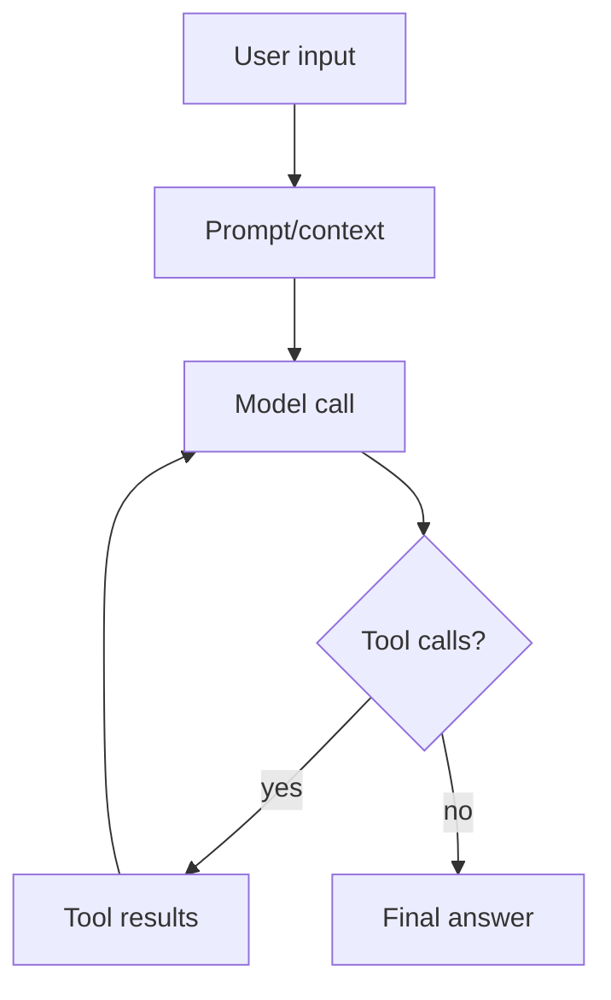

# Mermaid Diagrams

Use this skill when a small diagram makes the explanation easier to scan.

## When to use

Good fits:

- agentic loops and request/tool/result cycles;
- architecture or module dependency maps;
- state machines and permission flows;
- sequence diagrams for user/runtime/tool interactions;
- decision trees with several branches.

Avoid diagrams for simple one-step answers, tiny diffs, or when the user asked for maximum brevity.

## Output style

Preserve OPPi's normal user-facing voice: concise, professional, polished, a little playful. Do not add diagrams just for decoration.

Pattern:

1. One short sentence explaining what the diagram shows.
2. A small fenced `mermaid` block.
3. Optional bullets for important caveats or next steps.
4. When the user asks to render/preview/validate the diagram in-terminal, call the `render_mermaid` tool with the Mermaid source.

Example:

## Mermaid rules

- Keep node labels short and human-readable.
- Prefer `flowchart TD` for process/architecture and `sequenceDiagram` for interactions over time.
- Keep diagrams under ~12 nodes unless user asks for detail.
- Use stable identifiers without spaces; put display text in brackets.
- Add a text summary so terminals without Mermaid rendering still work.
- Use `render_mermaid` for terminal previews; it produces ASCII and may fall back to a simple renderer when the full renderer dependency is unavailable.
- If diagram syntax is uncertain, prefer a plain bullet list instead of invalid Mermaid.

## Reference

This skill is inspired by Oh My Pi's MIT-licensed `render_mermaid` tooling, which converts Mermaid source to ASCII for terminal display. See `references/oh-my-pi-render-mermaid.md` for attribution and implementation notes.
